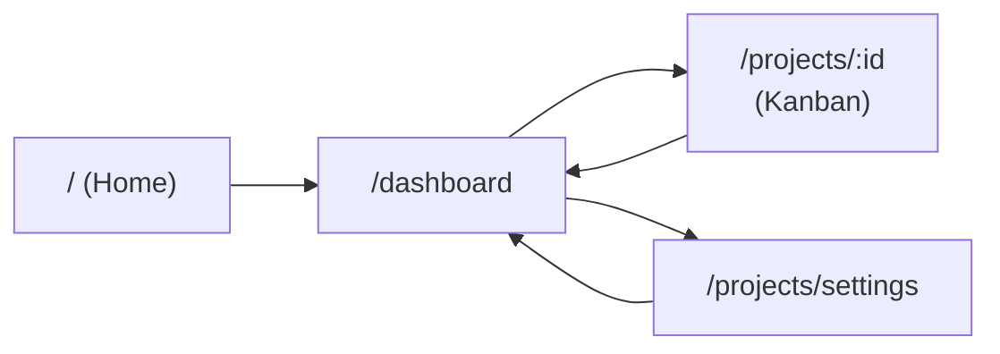

# Todo + Kanban — Visualization & Next Steps

This doc shows how the app is structured, how to run it, and what to do next.

---

## 1. Architecture overview

```
┌─────────────────────────────────────────────────────────────────────────────┐
│                              BROWSER (Next.js App)                           │
├─────────────────────────────────────────────────────────────────────────────┤
│  / (home)  →  redirect to /dashboard                                        │
│  /dashboard         →  Today's priorities, project filter, quick add task   │
│  /projects/[id]     →  Kanban board (Todo | In Progress | Done)             │
│  /projects/settings →  Create/edit/reorder/archive projects                  │
└─────────────────────────────────────────────────────────────────────────────┘
                                    │
                                    │ fetch /api/*
                                    ▼
┌─────────────────────────────────────────────────────────────────────────────┐
│                         NEXT.JS API ROUTES                                   │
│  GET/POST  /api/projects     GET/PATCH/DELETE  /api/projects/[id]           │
│  GET/POST  /api/tasks       GET/PATCH/DELETE  /api/tasks/[id]               │
│  GET       /api/cron/daily-digest  (Vercel Cron → Resend email)             │
└─────────────────────────────────────────────────────────────────────────────┘
                                    │
                                    │ Prisma
                                    ▼
┌─────────────────────────────────────────────────────────────────────────────┐
│  DATABASE (SQLite dev / Postgres or Turso prod)                             │
│  Project (id, name, order, archived)  ←──  Task (title, priority, dueDate,  │
│                                            column, orderInColumn)            │
└─────────────────────────────────────────────────────────────────────────────┘
```

---

## 2. User flow (screens)



| Route | What you see |
|-------|----------------|
| **/** | Redirects to Dashboard |
| **/dashboard** | Today’s priorities (by project filter), “Quick add task”, project cards linking to Kanban |
| **/projects/[id]** | Kanban board: drag tasks between Todo → In Progress → Done |
| **/projects/settings** | List of projects: create, edit, reorder, archive |

---

## 3. How to start the application

### One-time setup

1. **Install dependencies**
   ```bash
   npm install
   ```

2. **Environment**
   - Copy `.env.example` to `.env`
   - For local dev you can keep: `DATABASE_URL="file:./dev.db"`

3. **Database**
   ```bash
   npx prisma db push
   npm run db:seed
   ```
   This creates the SQLite DB and seeds projects A, B, C, General plus sample tasks.

### Run locally

```bash
npm run dev
```

Then open **http://localhost:3000**. You’ll be redirected to the dashboard.

### Other useful commands

| Command | Purpose |
|--------|---------|
| `npm run dev` | Start dev server |
| `npm run build` | Prisma generate + Next.js build |
| `npm run start` | Run production server (after `npm run build`) |
| `npm run db:push` | Push Prisma schema to DB (no migrations) |
| `npm run db:seed` | Seed projects and sample tasks |

---

## 4. Next steps

### Immediate (get it running)

- [ ] Run `npm install`, set up `.env`, then `npx prisma db push` and `npm run db:seed`
- [ ] Run `npm run dev` and open http://localhost:3000
- [ ] Click “Manage projects” and “Open Kanban board” to try the full flow

### Deploy (e.g. Vercel)

- [ ] Create a database (Vercel Postgres or Turso); set `DATABASE_URL`
- [ ] For Postgres: set `provider = "postgresql"` in `prisma/schema.prisma` and use `npx prisma migrate deploy`
- [ ] Set env vars: `RESEND_API_KEY`, `RESEND_FROM`, `DIGEST_EMAIL`, `CRON_SECRET`, `NEXT_PUBLIC_APP_URL`
- [ ] Deploy; Vercel Cron will hit `/api/cron/daily-digest` at 7:00 AM UTC

### Optional enhancements

- [ ] Add auth (e.g. NextAuth) so each user has their own projects/tasks
- [ ] Add due-date reminders (in-app or email)
- [ ] Add search/filter by title or priority on dashboard
- [ ] Add dark mode or theme toggle

---

## 5. Key files (reference)

| Path | Role |
|------|------|
| `app/page.tsx` | Redirects to `/dashboard` |
| `app/dashboard/page.tsx` | Dashboard: priorities, filter, add task, project cards |
| `app/projects/[id]/page.tsx` | Kanban board for one project |
| `app/projects/settings/page.tsx` | Manage projects |
| `app/api/projects/route.ts` | GET/POST projects |
| `app/api/projects/[id]/route.ts` | GET/PATCH/DELETE one project |
| `app/api/tasks/route.ts` | GET/POST tasks (optional `?projectId=`) |
| `app/api/tasks/[id]/route.ts` | GET/PATCH/DELETE one task |
| `app/api/cron/daily-digest/route.ts` | Cron: build digest, send via Resend |
| `prisma/schema.prisma` | Project & Task models |
| `components/Nav.tsx` | Top nav: Dashboard, Manage projects |

Use this doc to visualize the app, start it, and pick your next steps.
